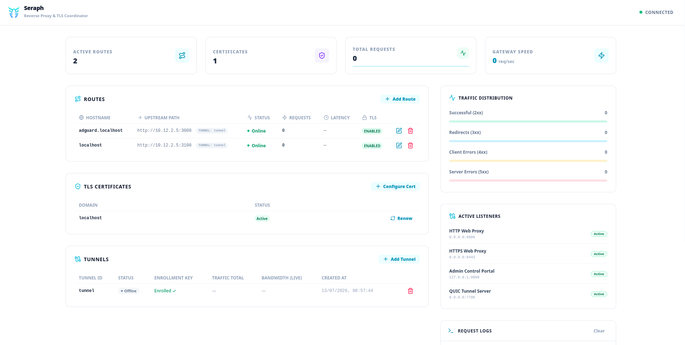

<p align="left">
  
</p>

# Seraph

**A self-hosted reverse proxy with QUIC tunneling, automated TLS, and a real-time dashboard — built with Rust & Pingora.**



---

## Features

- 🔀 **Reverse Proxy** – HTTP & HTTPS routing with virtual host support
- 🔒 **Automated TLS** – ACME/Let's Encrypt certificate provisioning and renewal
- 🚇 **QUIC Tunneling** – Expose local services through encrypted QUIC tunnels (mTLS)
- 📊 **Real-time Dashboard** – Svelte-based admin UI with live traffic stats
- 🔑 **Agent Enrollment** – Agents self-enroll via one-time keys, no manual cert handling

## Components

| Component | Description |
|-----------|-------------|
| `seraphd` | Core proxy daemon (Pingora-based, embeds the dashboard) |
| `seraph-agent` | Lightweight tunnel agent, runs on the client side |
| `dashboard` | Svelte frontend, embedded into `seraphd` at compile time |

## Getting Started

### Run locally

```bash
cargo run -p seraphd
```

The admin dashboard is available at `http://127.0.0.1:9090`.

### Docker

```bash
# Daemon
docker run -d \
  -p 80:8080 -p 443:8443 -p 127.0.0.1:9090:9090 -p 7700:7700/udp \
  -v seraph-data:/var/lib/seraph \
  -e SERAPHD_DATA_DIR=/var/lib/seraph \
  -e SERAPHD_HTTP_ADDR=0.0.0.0:8080 \
  -e SERAPHD_HTTPS_ADDR=0.0.0.0:8443 \
  -e SERAPHD_HTTPS_REDIRECT_PORT=443 \
  -e SERAPHD_ADMIN_ADDR=0.0.0.0:9090 \
  -e SERAPHD_ADMIN_KEY='replace-with-a-long-random-password' \
  -e SERAPHD_TUNNEL_ADDR=0.0.0.0:7700 \
  ghcr.io/konradx64/seraph-seraphd:latest

# Agent (first run — enrollment)
docker run -d \
  -v agent-data:/var/lib/seraph-agent \
  ghcr.io/konradx64/seraph-seraph-agent:latest \
  --server http://your-server:9090 \
  --key YOUR_ENROLLMENT_KEY
```

> After the first enrollment, the agent stores its identity in the volume and reconnects automatically on restart.

The admin dashboard is published on host loopback only. Access it locally on the server or through an SSH/VPN tunnel; HTTP Basic credentials must not be sent over an untrusted plain-HTTP connection.

## Configuration

`seraphd` is configured with command-line arguments. All arguments are optional and use the defaults shown below:

```bash
seraphd \
  --http-addr 0.0.0.0:8080 \
  --https-addr 0.0.0.0:8443 \
  --https-redirect-port 443 \
  --admin-addr 127.0.0.1:9090 \
  --admin-key 'replace-with-a-long-random-password' \
  --tunnel-addr 0.0.0.0:7700 \
  --data-dir data
```

Run `seraphd --help` for the complete command-line reference.

The same settings can be supplied through `SERAPHD_DATA_DIR`, `SERAPHD_HTTP_ADDR`, `SERAPHD_HTTPS_ADDR`, `SERAPHD_HTTPS_REDIRECT_PORT`, `SERAPHD_ADMIN_ADDR`, `SERAPHD_ADMIN_KEY`, and `SERAPHD_TUNNEL_ADDR`. Command-line arguments take precedence over environment variables. The admin key is required; sign in to the dashboard with username `admin` and the configured key as the password.

The data directory contains `seraph.db`, the tunnel CA files, and a `certs/` directory for TLS certificates and private keys.

## Architecture

```
  Internet
     │
     ▼
  seraphd  ──── HTTPS/HTTP ────▶  upstream services
     │
     │  QUIC (mTLS, UDP 7700)
     │
  seraph-agent  ──── TCP ────▶  local service
```

## License

MIT
